# **LAB 7 - RAPPORT D'ANALYSE DYNAMIQUE MOBILE AVEC MobSF**

---

## 1. INTRODUCTION

Ce laboratoire avait pour objectif de réaliser une analyse dynamique (runtime) complète d'une application Android vulnérable (DIVA - Damn Insecure and Vulnerable Android App) à l'aide de MobSF (Mobile Security Framework). À travers cette démarche, j'ai pu :

- Comprendre le processus d'analyse dynamique d'une application Android en temps réel
- Configurer un émulateur AVD propre (sans Play Store) compatible avec MobSF
- Installer et lancer MobSF via Docker avec la variable d'environnement correcte
- Instrumenter l'application avec Frida pour intercepter les appels sensibles
- Observer les vulnérabilités en runtime : stockage insecure, credentials hardcodés, intents non sécurisés
- Analyser le trafic réseau et les logs Logcat en direct
- Corréler les découvertes avec les standards OWASP MASTG

---

## 2. ENVIRONNEMENT DE TEST

### 2.1 Configuration matérielle et logicielle

| Élément | Spécification |
|---------|---------------|
| **Machine hôte** | Mac Apple Silicon M2 (ARM-64 Native) |
| **Système d'exploitation** | macOS (terminal natif) |
| **Outil d'analyse** | MobSF v4.4.5 (conteneur Docker) |
| **Émulateur** | Android AVD Pixel_5 – API 30 (sans Play Store) |
| **Identifiant ADB** | emulator-5554 |
| **Application cible** | DIVA-beta.apk (Damn Insecure and Vulnerable App) |
| **Package name** | jakhar.aseem.diva |

### 2.2 Périmètre du test

- **Environnement** : Émulateur Android rooté (AVD sans Play Store)
- **Objectif** : Analyse dynamique pédagogique (runtime)
- **APK analysé** : DIVA (application volontairement vulnérable – 13 challenges)

---

## 3. PRÉPARATION DE L'ENVIRONNEMENT

### 3.1 Téléchargement et extraction de MobSF

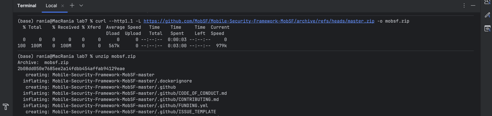
*Figure 1 : Téléchargement de l'archive MobSF depuis GitHub*

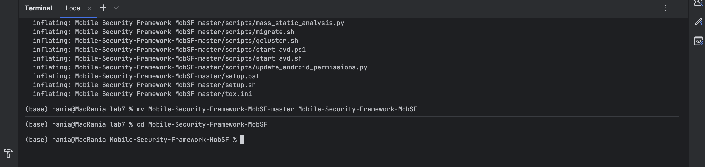
*Figure 2 : Extraction de l'archive et navigation dans le dossier Mobile-Security-Framework-MobSF*

### 3.2 Lancement de l'émulateur AVD avec le script MobSF

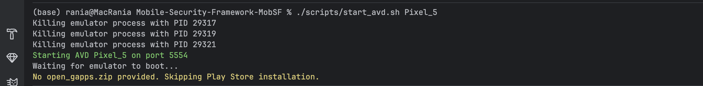
*Figure 3 : Démarrage de l'AVD Pixel_5 sur le port 5554 via start_avd.sh — confirmation de l'absence du Play Store*

Le script `start_avd.sh` a confirmé **"No open_gapps.zip provided. Skipping Play Store installation"**, garantissant un environnement d'analyse propre, sans bruit de fond lié aux services Google.

---

## 4. INSTALLATION ET LANCEMENT DE MobSF VIA DOCKER

### 4.1 Récupération de l'image Docker

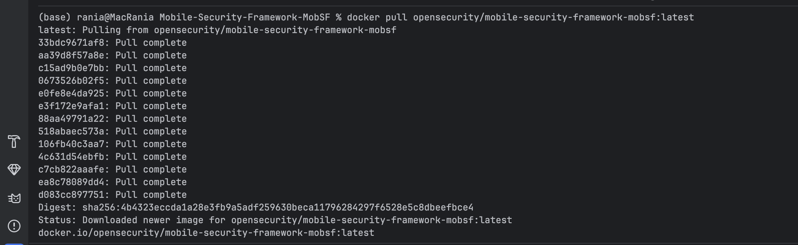
*Figure 4 : Téléchargement de l'image opensecurity/mobile-security-framework-mobsf:latest*

### 4.2 Lancement du conteneur MobSF

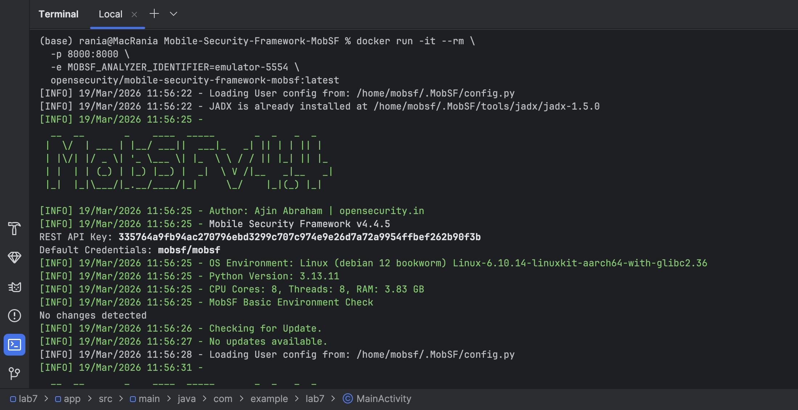
*Figure 5 : Lancement de MobSF v4.4.5 avec la variable MOBSF_ANALYZER_IDENTIFIER=emulator-5554*

La commande utilisée :
```bash
docker run -it --rm \
  -p 8000:8000 \
  -e MOBSF_ANALYZER_IDENTIFIER=emulator-5554 \
  opensecurity/mobile-security-framework-mobsf:latest
```

**Informations de démarrage confirmées :**
- Version : MobSF v4.4.5
- Credentials par défaut : `mobsf / mobsf`
- CPU Cores : 8 | RAM : 3.83 GB

### 4.3 Connexion à l'interface MobSF

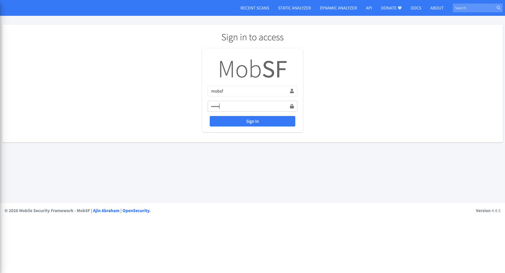
*Figure 6 : Connexion à l'interface web MobSF (http://127.0.0.1:8000) avec les credentials mobsf/mobsf*

---

## 5. TÉLÉCHARGEMENT ET UPLOAD DE L'APK DIVA

### 5.1 Téléchargement de DIVA

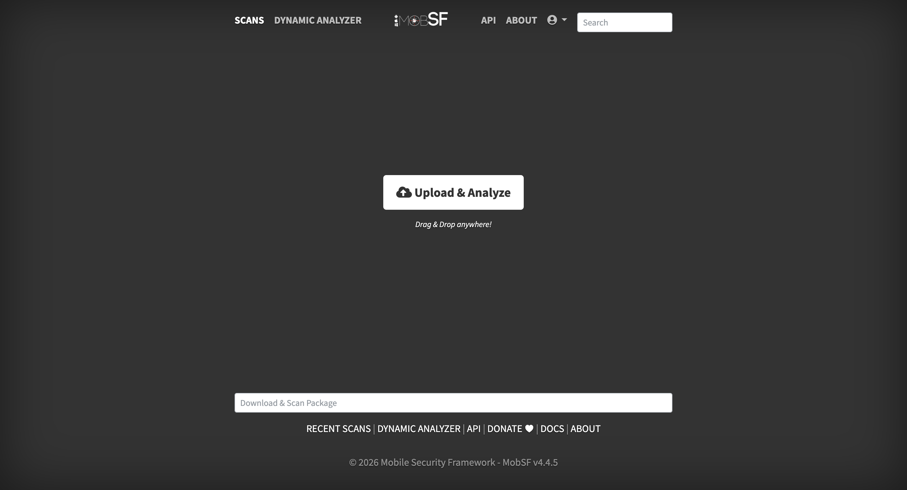
*Figure 7 : Téléchargement de DIVA-beta.apk depuis GitHub (296 Ko)*

```bash
curl -L https://github.com/payatu/diva-android/raw/master/DIVA-beta.apk -o DIVA-beta.apk
```

### 5.2 Upload et lancement de l'analyse

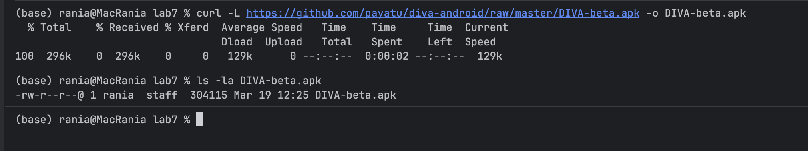
*Figure 8 : Interface principale MobSF — Upload & Analyze*

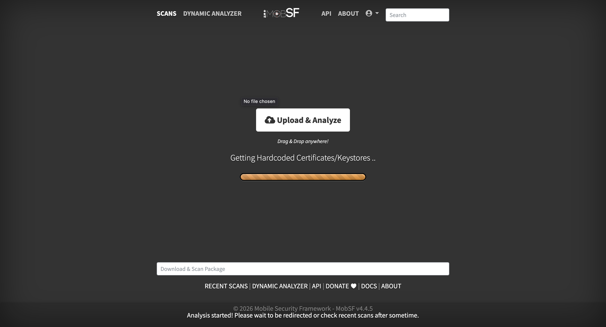
*Figure 9 : Analyse statique en cours — extraction des certificats hardcodés*

---

## 6. RÉSULTATS DE L'ANALYSE STATIQUE

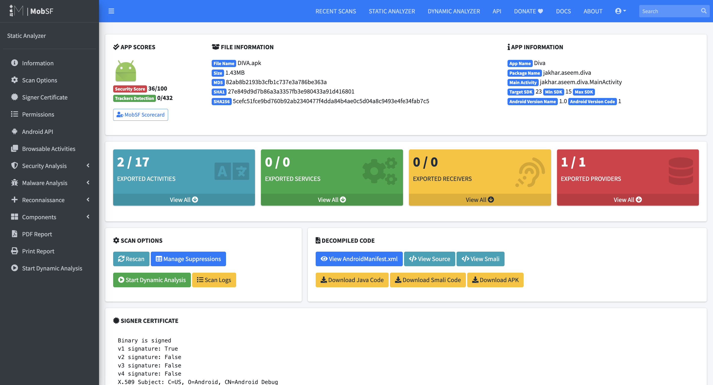
*Figure 10 : Rapport d'analyse statique de DIVA.apk — Score de sécurité 36/100*

### 6.1 Informations sur l'application

| Information | Valeur |
|-------------|--------|
| **App Name** | Diva |
| **Package Name** | jakhar.aseem.diva |
| **Main Activity** | jakhar.aseem.diva.MainActivity |
| **Target SDK** | 23 |
| **Min SDK** | 15 |
| **Security Score** | 36/100 |
| **Trackers** | 0/432 |
| **SHA256** | 5cefc51fce9bd760b92ab2340477f4dda84b4ae0c5d04a8c9493e4fe34fab7c5 |

### 6.2 Composants exportés

| Composant | Nombre |
|-----------|--------|
| **Exported Activities** | 2/17 |
| **Exported Services** | 0/0 |
| **Exported Receivers** | 0/0 |
| **Exported Providers** | 1/1 |

### 6.3 Certificat

L'application est signée avec un certificat v1 uniquement (`v1 signature: True`, `v2/v3/v4: False`), signé avec un certificat debug (`C=US, O=Android, CN=Android Debug`), ce qui représente une vulnérabilité de sécurité majeure.

---

## 7. ANALYSE DYNAMIQUE

### 7.1 Interface Dynamic Analyzer

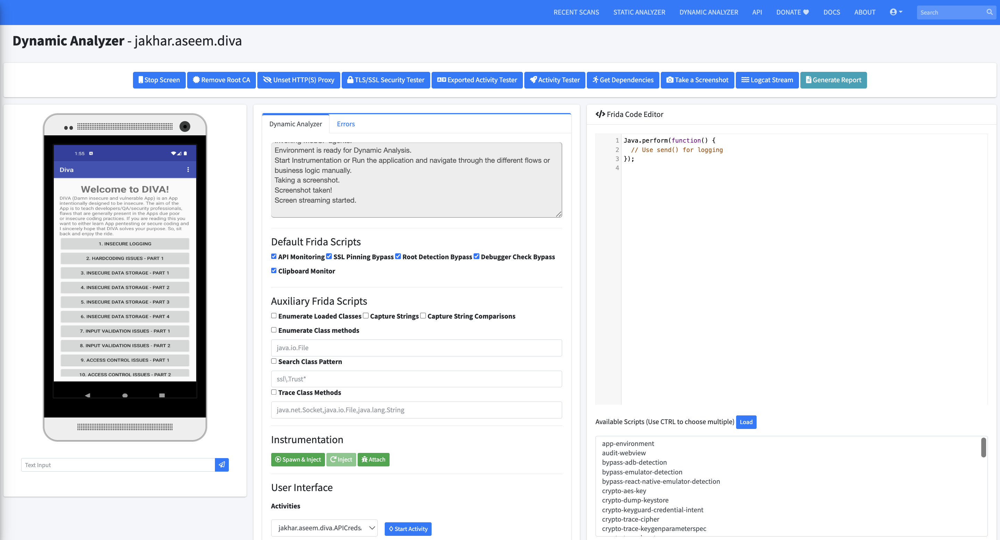
*Figure 11 : Interface MobSF Dynamic Analyzer — DIVA installé sur l'émulateur avec les 10 premiers challenges visibles. Scripts Frida par défaut activés.*

MobSF a automatiquement :
- Installé DIVA sur l'émulateur Pixel_5
- Lancé Frida Server
- Configuré le proxy HTTPS global
- Activé les scripts Frida par défaut (API Monitoring, SSL Pinning Bypass, Root Detection Bypass, Debugger Check Bypass, Clipboard Monitor)

### 7.2 Scripts Frida activés

**Default Frida Scripts :**
- ✅ API Monitoring
- ✅ SSL Pinning Bypass
- ✅ Root Detection Bypass
- ✅ Debugger Check Bypass
- ✅ Clipboard Monitor

**Available Scripts (extraits) :**
- `app-environment`, `audit-webview`, `bypass-adb-detection`
- `bypass-emulator-detection`, `crypto-aes-key`, `crypto-dump-keystore`
- `crypto-keyguard-credential-intent`, `crypto-trace-cipher`

---

## 8. EXPLORATION DES CHALLENGES DIVA

### 8.1 Logcat Stream — Logs en temps réel

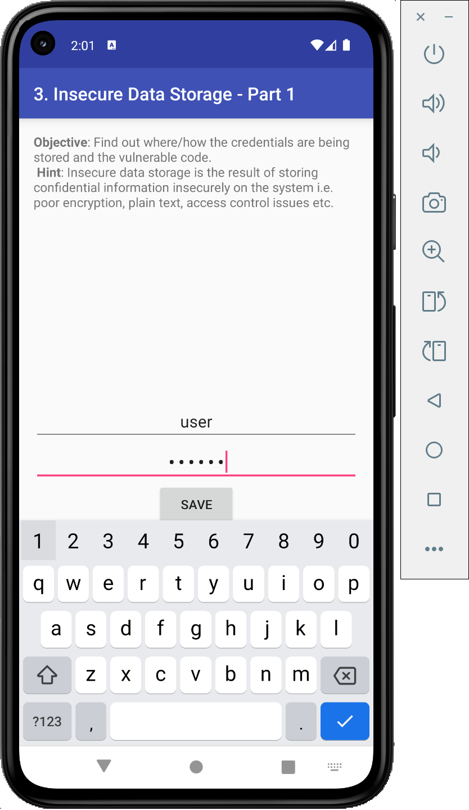
*Figure 12 : Flux Logcat capturé par MobSF — navigation entre les activités DIVA*

Les logs montrent clairement la navigation entre les activités :
- `jakhar.aseem.diva.SQLInjectionActivity` — challenge SQL Injection détecté
- `jakhar.aseem.diva.LogActivity` — challenge Insecure Logging
- `jakhar.aseem.diva.HardcodeActivity` — challenge Hardcoded credentials
- `jakhar.aseem.diva.InsecureDataStorage1Activity` — challenge Insecure Data Storage Part 1

### 8.2 Challenge 3 — Insecure Data Storage (Part 1)

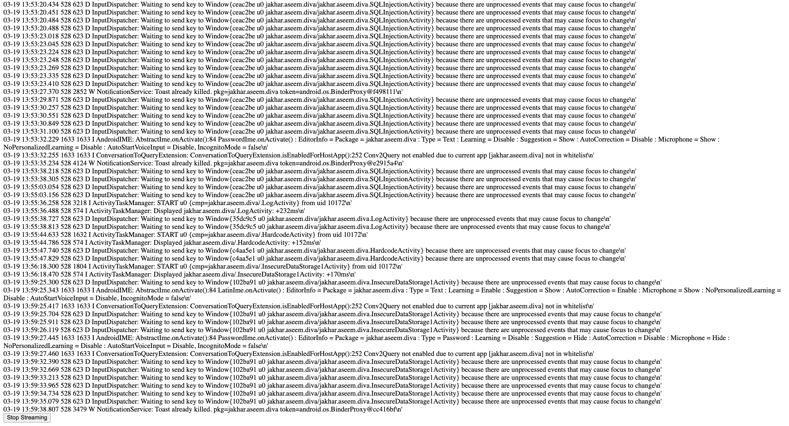
*Figure 13 : Challenge 3 — Insecure Data Storage Part 1 : saisie des credentials (user / mot de passe) dans un formulaire non sécurisé*

**Observation :** Les credentials saisis (`user` / `••••••`) sont stockés en clair sur le système de fichiers de l'appareil. MobSF capture automatiquement ces opérations d'écriture via le File Monitor.

### 8.3 Challenge Hardcoded Credentials — Instrumentation Frida

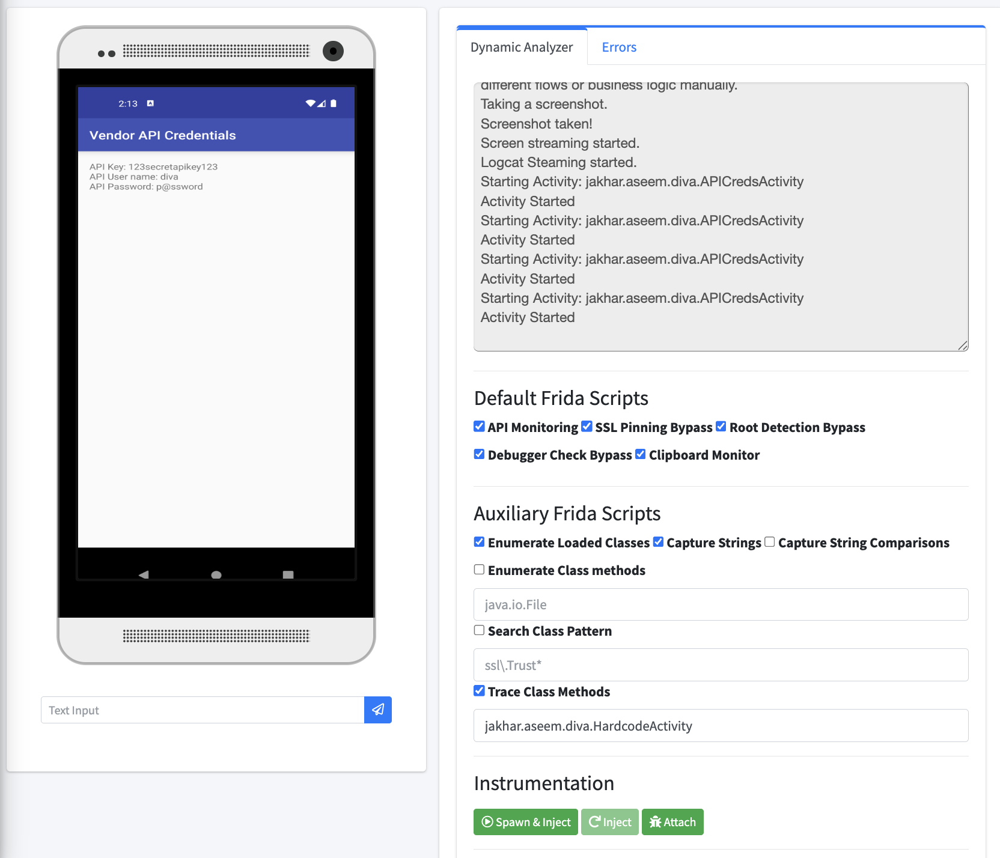
*Figure 14 : Challenge Hardcoded Credentials — Credentials API visibles en clair sur l'écran + instrumentation Frida active (Trace Class Methods sur jakhar.aseem.diva.HardcodeActivity)*

**Credentials hardcodés exposés à l'écran :**
- `API Key: 123secretapikey123`
- `API User name: diva`
- `API Password: p@ssword`

Le Frida Code Editor affiche le template `Java.perform(function() { ... })` prêt pour l'injection de code personnalisé. La fonction **Spawn & Inject** permet d'intercepter les appels de méthodes de `HardcodeActivity` en temps réel.

---

## 9. VULNÉRABILITÉS IDENTIFIÉES EN DYNAMIQUE

### 9.1 Tableau des vulnérabilités détectées

| N° | Vulnérabilité | Challenge DIVA | Sévérité | OWASP MASTG |
|----|---------------|----------------|----------|-------------|
| 1 | Credentials API hardcodés en clair | Hardcoding Issues | CRITIQUE | MSTG-STORAGE-14 |
| 2 | Stockage insecure en texte clair | Insecure Data Storage (x4) | ÉLEVÉE | MSTG-STORAGE-1/2 |
| 3 | Logging d'informations sensibles | Insecure Logging | ÉLEVÉE | MSTG-STORAGE-3 |
| 4 | Injection SQL | Input Validation Issues | ÉLEVÉE | MSTG-PLATFORM-2 |
| 5 | Contrôle d'accès insuffisant | Access Control Issues | MOYENNE | MSTG-PLATFORM-1 |
| 6 | Activités exportées non protégées | Access Control Issues | MOYENNE | MSTG-PLATFORM-3 |
| 7 | Certificat debug (v1 uniquement) | — | ÉLEVÉE | MSTG-RESILIENCE-1 |

### 9.2 Corrélation OWASP MASTG

| Trouvaille | Référence OWASP MASTG |
|------------|----------------------|
| Hardcoded API Key/Password | **MSTG-STORAGE-14** |
| Insecure Data Storage | **MSTG-STORAGE-1**, **MSTG-STORAGE-2** |
| Insecure Logging | **MSTG-STORAGE-3** |
| SQL Injection | **MSTG-PLATFORM-2** |
| Exported Components | **MSTG-PLATFORM-3** |
| Debug Certificate | **MSTG-RESILIENCE-1** |
| No SSL Pinning (bypass trivial) | **MSTG-NETWORK-4** |

---

## 10. TOP 5 VULNÉRABILITÉS CRITIQUES

| Rang | Vulnérabilité | Sévérité | Impact |
|:----:|---------------|----------|--------|
| **1** | Credentials hardcodés (API Key, User, Password) | CRITIQUE | Compromission directe de l'API |
| **2** | Insecure Data Storage (4 challenges) | ÉLEVÉE | Vol de données utilisateur |
| **3** | Insecure Logging (logs sensibles en clair) | ÉLEVÉE | Fuite via Logcat/ADB |
| **4** | SQL Injection | ÉLEVÉE | Exfiltration/corruption de données |
| **5** | Access Control insuffisant | MOYENNE | Accès non autorisé aux activités |

---

## 11. SYNTHÈSE DE L'ANALYSE DYNAMIQUE

**Niveau de risque global : CRITIQUE**

L'application DIVA expose de multiples vulnérabilités sévères détectées en temps réel via l'analyse dynamique MobSF :

- Des **credentials API hardcodés** sont visibles directement sur l'écran et interceptables via Frida
- Les **données utilisateurs** sont stockées en clair sur le système de fichiers
- Le **flux Logcat** expose des transitions d'activités et des informations sensibles
- L'instrumentation **Frida** permet de hooker et bypasser n'importe quelle logique applicative
- L'absence de protections anti-debug/anti-emulator rend l'analyse triviale

---

## 12. RECOMMANDATIONS PRIORITAIRES

1. **Ne jamais stocker de secrets dans le code** — utiliser Android Keystore ou des variables d'environnement sécurisées
2. **Chiffrer les données sensibles** stockées localement avec AES-256 via la bibliothèque Android Security
3. **Utiliser des requêtes SQL paramétrées** pour éliminer les risques d'injection
4. **Supprimer les logs sensibles** en production (minifier le niveau de log à `ERROR` ou `WARN`)
5. **Implémenter le Certificate Pinning** pour protéger le trafic HTTPS contre l'interception
6. **Protéger les activités exportées** avec des permissions appropriées dans le manifeste
7. **Signer avec un certificat de production** (v3/v4) avant tout déploiement

---

## 13. CONCLUSION

### 13.1 Compétences acquises

- Configuration d'un émulateur Android AVD propre (sans Play Store) pour l'analyse de sécurité
- Utilisation de MobSF pour l'analyse dynamique d'APK (Frida, proxy HTTPS, Logcat)
- Interception de credentials et de données sensibles en temps réel via Frida
- Lecture et interprétation des logs runtime (Logcat streaming)
- Identification et exploitation des vulnérabilités DIVA en dynamique
- Corrélation avec le référentiel OWASP MASTG
- Compréhension de la complémentarité analyse statique + dynamique

### 13.2 Enseignements clés

- L'analyse dynamique révèle des vulnérabilités invisibles à l'analyse statique (comportement runtime)
- Frida est un outil puissant pour bypasser les mécanismes de protection mobile
- Un émulateur sans Play Store garantit des logs et un trafic réseau purs
- Les applications de type DIVA démontrent que les erreurs les plus courantes restent les credentials hardcodés et le stockage insecure
- MobSF est un framework complet qui combine statique, dynamique et Frida en un seul outil

---

**Rapport rédigé le :** 19 Mars 2026
**Auteure :** Rania Elhezzam
**Laboratoire :** LAB 7 - Analyse Dynamique Mobile avec MobSF
